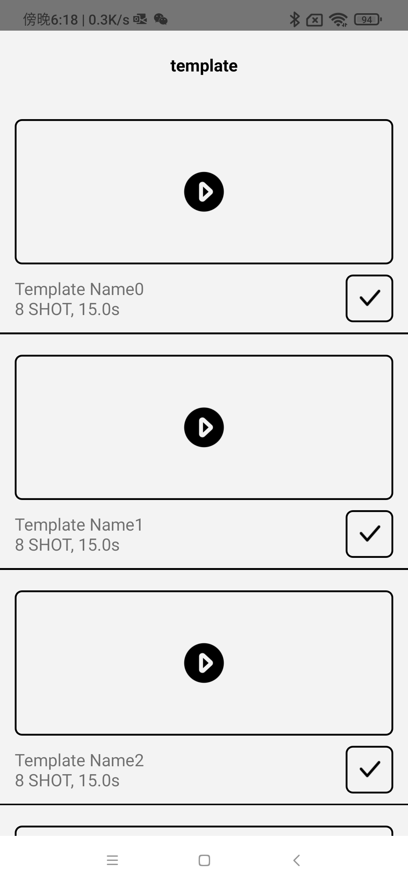
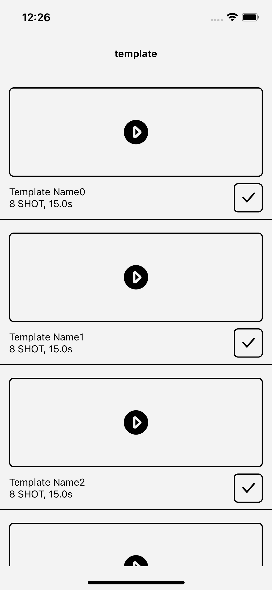

# react native object
### 描述

>项目使用了 react-native typescript

### 启动
在项目根目录下执行以下命令安装依赖
#### 安装依赖

```
yarn install || npm install 
```

### 构建 android、ios

```
yarn run android | npm run android
yarn run ios | npm run ios
```

### android screenshot


### ios screenshot

